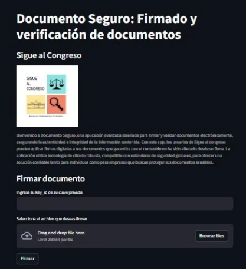

# digital_signatures_SaC

## Objetivo
Este repositorio contiene una aplicación que tiene como objetivo ser utilizada por los trabajadores de Sigue al Congreso para firmar documentos que serán subidos a la Página Web de la organización

  

## Funciones
La aplicación ofrece las siguientes funciones principales:

Añadir clave pública: Permite añadir una clave pública para la verificación de documentos firmados.

Eliminar clave pública: Permite eliminar una clave pública que ya no es necesaria.

Firmar documentos: Permite firmar documentos electrónicos para asegurar su integridad y autenticidad.

Validar documentos firmados: Permite verificar documentos firmados para asegurar que no han sido alterados y que la firma es auténtica.

## Manual de Usuario
Se ha generado un manual detallado para la creación de llaves y el uso de la aplicación. Por favor, consulta el archivo [Manual_de_usuario.pdf](manual) para obtener instrucciones detalladas sobre cómo utilizar cada una de las funciones de la aplicación.

## Instalación
Para instalar y ejecutar la aplicación, sigue estos pasos:

Clona este repositorio:

    git clone https://github.com/tu-usuario/documento-seguro.git
      
Navega al directorio del proyecto:

    cd documento-seguro
      
Instala las dependencias necesarias:

    pip install -r requirements.txt
    
## Uso

### Añadir Clave Pública
Para añadir una clave pública, utiliza la función correspondiente en la interfaz de la aplicación

### Eliminar Clave Pública
Para eliminar una clave pública, utiliza la función correspondiente en la interfaz de la aplicación

### Firmar Documentos
Para firmar un documento, utiliza la función correspondiente en la interfaz de la aplicación

### Validar Documentos Firmados
Para validar un documento firmado, utiliza la función correspondiente en la interfaz de la aplicación

### Ejemplo de uso

  

